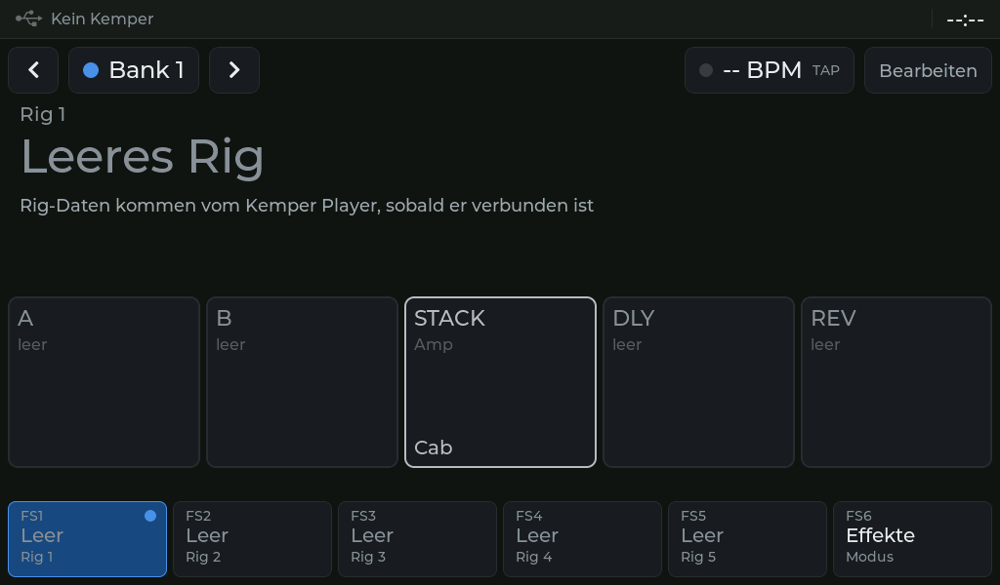
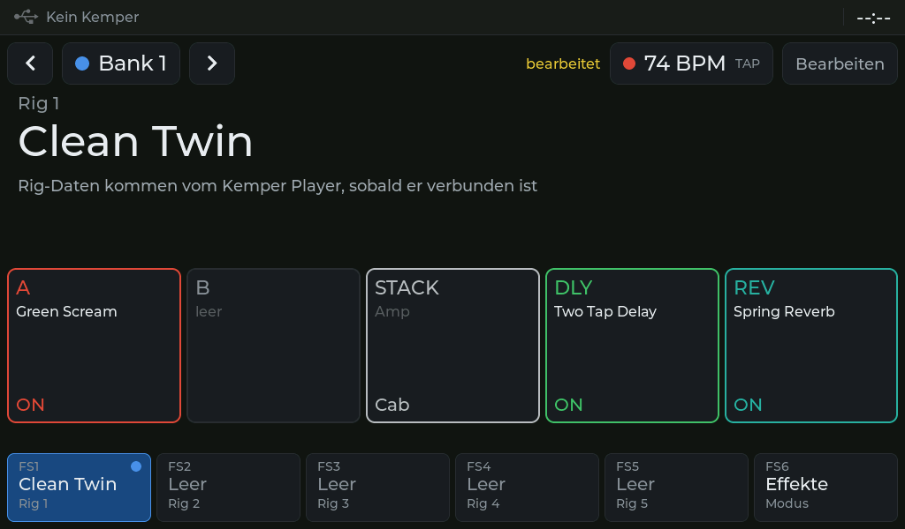
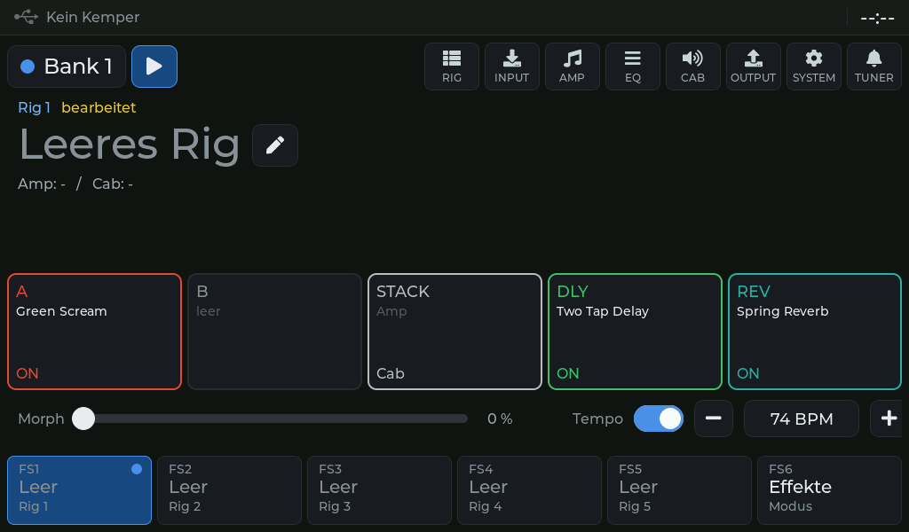
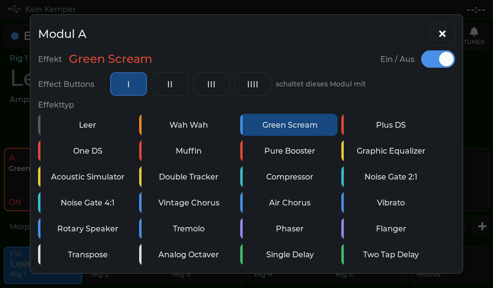
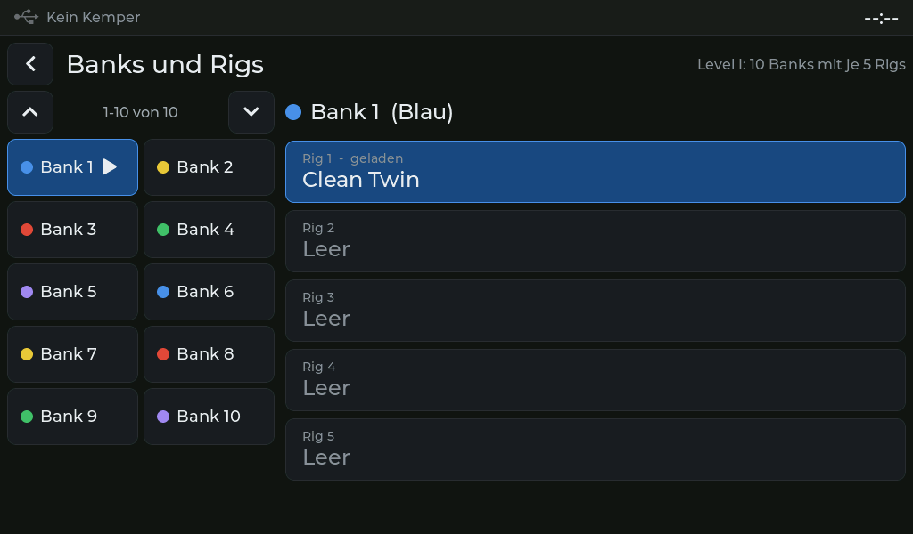
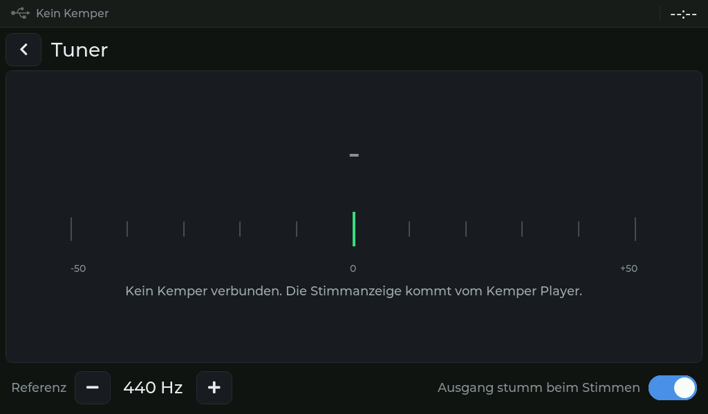
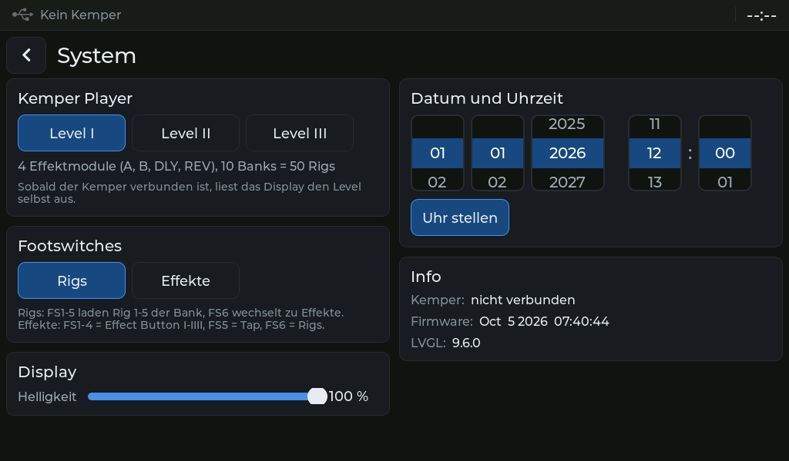
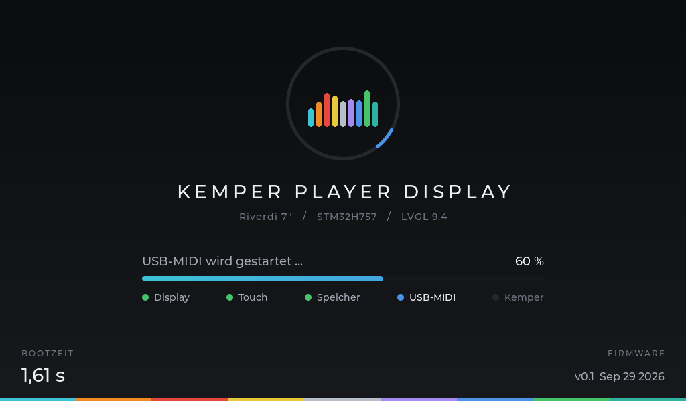
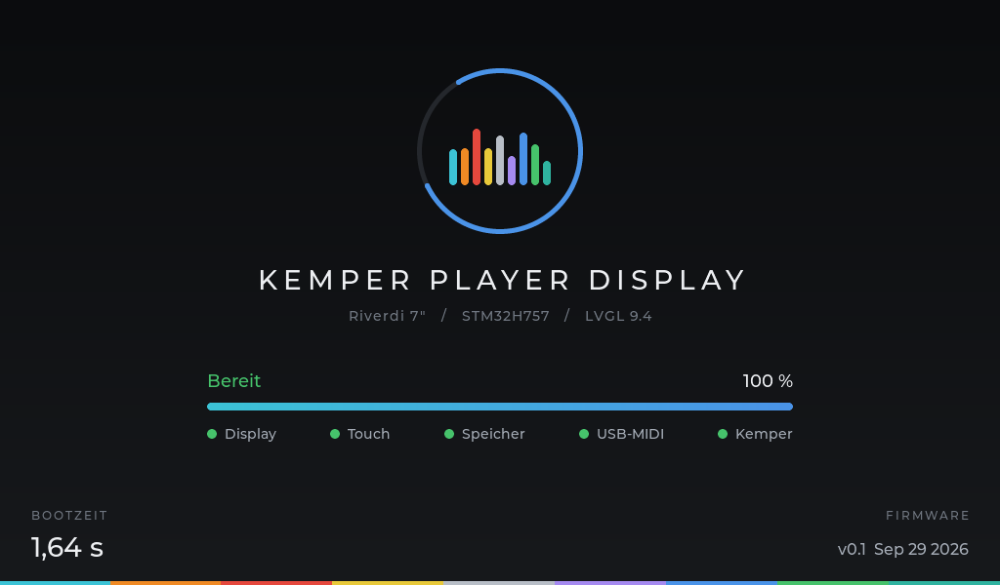

# Kemper Player Display

Eigenbau-Controller für den **Kemper Profiler Player**: 7"-Touch-Display (Riverdi, STM32H757) mit sechs Footswitches (3 oben, 3 unten). Die Oberfläche orientiert sich am Rig Manager und läuft mit **LVGL** direkt auf dem Display.

## Vorschau

**Live-Ansicht** (zum Spielen, große Schrift) – so startet das Display ohne Kemper, alle Rigs sind leer:



Dieselbe Ansicht, nachdem am Display Effekte gewählt, das Rig umbenannt und das Tempo getippt wurde:



**Bearbeiten-Ansicht** (zum Einstellen) und der Dialog eines Effektmoduls:





**Bank-Übersicht**, **Tuner** und **System**:







Alle Bilder sind echte Renderings aus LVGL mit genau dem Code in diesem Repository (PC-Simulation mit simulierten Touch-Eingaben).

**Startbildschirm** mit Fortschritt und gemessener Bootzeit:





## Interaktiver HTML-Prototyp

Im Ordner [`prototype/`](prototype/) liegt die komplette Bedienoberfläche als HTML zum Ausprobieren, inklusive Startseite, Performance-Browser, Bank-Übersicht, Effekt-Details, Tuner, Einstellungen, Stomp-Belegung, Morph, Setlist-Ansicht, Setlist Manager und Song-Editor (Teile wie Intro, Verse, Solo mit eigenem Slot, Bildschirmtastatur):

| Datei | Inhalt |
|---|---|
| [`kemper-display.html`](prototype/kemper-display.html) | Nur das Display, füllt das ganze Browserfenster |
| [`kemper-display-mit-hilfe.html`](prototype/kemper-display-mit-hilfe.html) | Display mit Gehäuserahmen und Bedienhinweisen |

**Öffnen:** Da das Repository privat ist, zeigt GitHub HTML-Dateien nur als Quelltext an. So geht es:

1. Datei in GitHub öffnen und oben rechts auf **Download raw file** tippen
2. Die heruntergeladene Datei im Browser öffnen (am Handy im Querformat)

Oder das Repository klonen und die Datei per Doppelklick öffnen. Eigene Effekt-Icons kannst du in einen Ordner `prototype/icons/` legen (Details in der Hilfe-Version).

## Firmware bauen und aufspielen

Basis ist der offizielle LVGL-Port für das Riverdi-7"-Display ([lvgl/lv_port_riverdi_70-stm32h7](https://github.com/lvgl/lv_port_riverdi_70-stm32h7)), passend für das **RVT70HSSNWC00-B**. Statt der LVGL-Demo startet die Kemper-Oberfläche.

**Benötigt:** STM32CubeIDE, ST-LINK (V2/V3) oder J-Link, Netzteil 6–48 V (z. B. 9 V).

1. Repository klonen
2. STM32CubeIDE öffnen: **File → Open Projects from File System… → Directory** → Ordner `firmware/STM32CubeIDE` wählen → **Finish**
3. Im Project Explorer das Unterprojekt **`…_CM7`** auswählen
4. **Project → Build Project** (für beste Leistung Konfiguration *Release*)
5. Display mit Netzteil versorgen, Debugger an den SWD-Anschluss, dann **Run** zum Flashen

Beim Einschalten erscheint der Startbildschirm und zeigt Fortschritt und Bootzeit (Millisekunden seit Reset). Danach blendet er zur Live-Ansicht über.

## Bedienung (ohne Kemper)

Die Oberfläche bildet nur den **Kemper Profiler Player** ab: Banks mit je 5 Rigs (keine Performances), Bankfarben wie die LEDs am Player, Effect Buttons I–IIII. Ohne Kemper sind alle Rigs leer; alles, was am Display geändert wird, landet im Datenmodell und wird später per USB-MIDI an den Kemper geschickt.

| Ansicht | Was funktioniert |
|---|---|
| **Live** | Bank wechseln (Pfeile), Bank antippen → Bank-Übersicht, Effektmodul antippen → ein/aus, Tempo antippen → Tap Tempo, „bearbeitet“-Hinweis wie am Kemper |
| **Footswitch-Leiste** | Modus *Rigs*: FS1–5 = Rig 1–5, FS6 → Effekte. Modus *Effekte*: FS1–4 = Effect Button I–IIII, FS5 = Tap, FS6 → Rigs |
| **Bearbeiten** | Modul antippen → Effekttyp, Ein/Aus, Zuweisung zu Effect Buttons; RIG/INPUT/AMP/EQ/CAB/OUTPUT → Regler; Rig umbenennen (Bildschirmtastatur); Morph; Tempo ein/aus, ± |
| **Banks** | Banks seitenweise (je 10), Rig antippen → laden |
| **Tuner** | Referenz 424–456 Hz, Stummschaltung; Ton und Abweichung kommen vom Kemper |
| **System** | Player-Level I/II/III, Footswitch-Modus, **Helligkeit** (PWM), **Uhr stellen** (RTC), Info |

Signalkette je Ausbaustufe: Level I/II `A, B | Stack | DLY, REV` mit 10 Banks; Level III `A, B, C, D | Stack | X, MOD, DLY, REV` mit 125 Banks.

**Hinweise:** Die eingebauten LVGL-Fonts enthalten keine Umlaute, deshalb kommen in der Oberfläche keine vor. Die Wertebereiche der Parameter sind vorläufig und werden bei der MIDI-Anbindung an die Kemper-Werte angeglichen. Einstellungen werden noch nicht dauerhaft gespeichert.

**Uhrzeit:** Beim allerersten Start stellt die Firmware den RTC auf den Zeitpunkt des Builds (`__DATE__`/`__TIME__`) und merkt sich das im Backup-Register. Der RTC läuft derzeit mit dem internen LSI-Oszillator, geht also ungenau und behält die Zeit ohne Versorgung nicht. Für eine dauerhaft richtige Uhr braucht es LSE (32,768-kHz-Quarz) und eine Pufferung an VBAT.

## Aufbau des Repositorys

```
firmware/                     STM32CubeIDE-Projekt (Basis: LVGL-Riverdi-Port)
├── CM7/UI/                   Kemper-Oberfläche
│   ├── ui_boot.c / .h        Startbildschirm mit Fortschritt und Bootzeit
│   ├── kemper_player.c / .h  Datenmodell des Players (Banks, Rigs, Module, Effect Buttons,
│   │                         Parameter, Tempo, Tuner, Footswitches); kp_link_* = Richtung
│   │                         Kemper (noch leer), kp_rx_* = Daten vom Kemper
│   ├── ui_common.c / .h      Stile, Navigation, Effektkette, Footswitch-Leiste, Dialoge
│   ├── ui_live.c / .h        Live-Ansicht, Einstieg ui_start(), ui_footswitch()
│   ├── ui_edit.c             Bearbeiten-Ansicht, Modul-Dialog, Umbenennen
│   ├── ui_banks.c            Bank-Übersicht
│   ├── ui_tuner.c            Tuner
│   ├── ui_settings.c         System (Level, Footswitch-Modus, Helligkeit, Uhr, Info)
│   ├── ui_statusbar.c / .h   Statusleiste: USB-Status, Datum, Uhrzeit
│   └── xml/                  Frühere Ansichten als LVGL-XML (veraltet, nur Referenz)
├── CM7/Core/Src/main.c       Startbildschirm, Init-Schritte, dann ui_start()
├── CM7/Core/Src/rtc.c        RTC als Zeitquelle für die Statusleiste, Uhr stellen
├── Middlewares/Third_Party/LVGL/lv_conf.h   Fonts aktiviert, Demos aus
└── STM32CubeIDE/             Projektdateien (CM7 und CM4)
prototype/                    Interaktiver HTML-Prototyp
docs/                         Konzept, Einkaufsliste, Kemper-Protokoll, Bilder
```

## Nächste Schritte

- [ ] USB-MIDI-Device auf dem M4-Kern (TinyUSB), erste Kemper-Befehle
- [x] Datenmodell des Players (Banks, Rigs, Module, Effect Buttons) und Anbindung an die Oberfläche
- [x] Screens: Bank-Übersicht, Tuner, System, Modul- und Parameter-Dialoge
- [ ] kp_link_* / kp_rx_* mit USB-MIDI füllen (Rig laden, Effekte, Tempo, Tuner, Namen)
- [ ] Footswitches und LEDs über den 40-Pin-Header (Einstieg: `ui_footswitch()`)
- [ ] Fonts mit Umlauten, Einstellungen dauerhaft speichern
- [ ] Startseite, Setlist-Bereich und Setlist Manager

Mehr zum Konzept in [`docs/konzept.md`](docs/konzept.md).

## Hinweise

- Der Riverdi/LVGL-Port nutzt STM32Cube-HAL (BSD-3), FreeRTOS (MIT) und LVGL (MIT). Die Original-Anleitung des Ports liegt unter [`firmware/README.md`](firmware/README.md).
- Um das Repository schlank zu halten, wurden aus LVGL die Ordner `tests`, `docs`, `scripts`, `examples` und `demos` entfernt. Sie werden für den Build nicht gebraucht.
